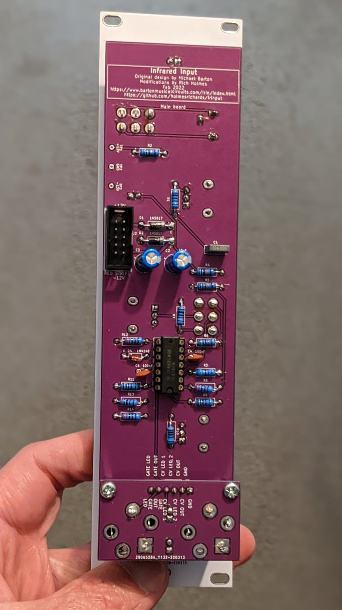

# Barton IR Input

This is a modified version, in Kosmo format, of the [Barton Musical Circuits 078 IR Input](https://www.bartonmusicalcircuits.com/irin/index.html) synth module. Barton describes the original version as follows:

> This module is designed to allow infrared light sources to interact with your synthesizer. The most common household sources of infrared light are fire and remote controls. Infrared LEDs are also readily available to DIYers who wanted to experiment with creating new devices for controlling synthesizers through this module.

The infrared phototransistor that picks up the IR light may be AC or DC coupled to the circuit. Outputs are a CV proportional to the IR signal and a gate that turns on when the CV rises above a threshold set with a panel pot. Another panel pot sets the phototransistor sensitivity.

Modifications to Barton's design are as follows:

* Added 3.5 mm TRS jack for a cable connecting to an external phototransistor and a switch to select internal or external PT. This allows using candles, lighters, etc. to control the synth while not having to have them right in front of it.
* Added gain knob to control gain of amplifier stage. The sensitivity pot (what Barton calls "bias") does vary the size of the signal but gives a small window between too small (no output) and too large (saturated). In AC coupled mode, the size of the AC component may be small, e.g. a few hundred mV, even when the sensitivity pot is set to just below saturation; of course the AC component disappears if the sensitivity pot is then raised further. The gain pot may be used to amplify the AC component to the level of a few volts. In AC mode, the gain range is 1 to 11. In DC mode, the gain pot may be used to help with faint IR sources; the gain range is 1 to 2.
* Added a bicolor indicator LED for the CV output. Brightness is indicative of CV amplitude and color indicates sign (which is positive in DC mode but can go negative in AC mode). 
* Added an indicator LED for saturation. This turns on when the PT emitter voltage is about 10 V. Normally one would want to operate with the sensitivity pot adjusted to just below where this LED comes on continuously while the IR light source is maximum.
* Specified A1M rather than B1M for sensitivity pot.

My modifications, PCB layout, and documentation are licensed Creative Commons Zero (see [LICENSE](LICENSE)). This license is not intended to apply to Michael Barton's intellectual property and no violation of any applicable copyright is intended. Do not use this design for any commercial purpose without first obtaining Barton's permission.


## Current draw
12 mA +12 V, 8 mA -12 V


## Photos





## Documentation

* [Schematic](Docs/irinput.pdf)
* PCB layout: [front](Docs/_layout_front.pdf), [back](Docs/_layout_back.pdf)
* [BOM](Docs/irinput_bom.md)
* [Build notes](Docs/irinput_build.md)

## GitHub repository

* [https://github.com/holmesrichards/irinput](https://github.com/holmesrichards/irinput)

## Submodules

This repo uses submodules aoKicad and Kosmo_panel, which provide needed libaries for KiCad. To clone:

```
git clone git@github.com:holmesrichards/ir_input.git
git submodule init
git submodule update
```


Alternatively do

```
git clone --recurse-submodules git@github.com:holmesrichards/ir_input.git
```

Or if you download the repository as a zip file, you must also click on the "aoKicad" and "Kosmo\_panel" links on the GitHub page (they'll have "@ something" after them) and download them as separate zip files which you can unzip into this repo's aoKicad and Kosmo\_panel directories.

If desired, copy the files from aoKicad and Kosmo\_panel to wherever you prefer (your KiCad user library directory, for instance, if you have one). Then in KiCad, add symbol libraries 

```
aoKicad/ao_symbols
Kosmo_panel/Kosmo
```
and footprint libraries 
```
aoKicad/ao_tht
Kosmo_panel/Kosmo_panel.
```
